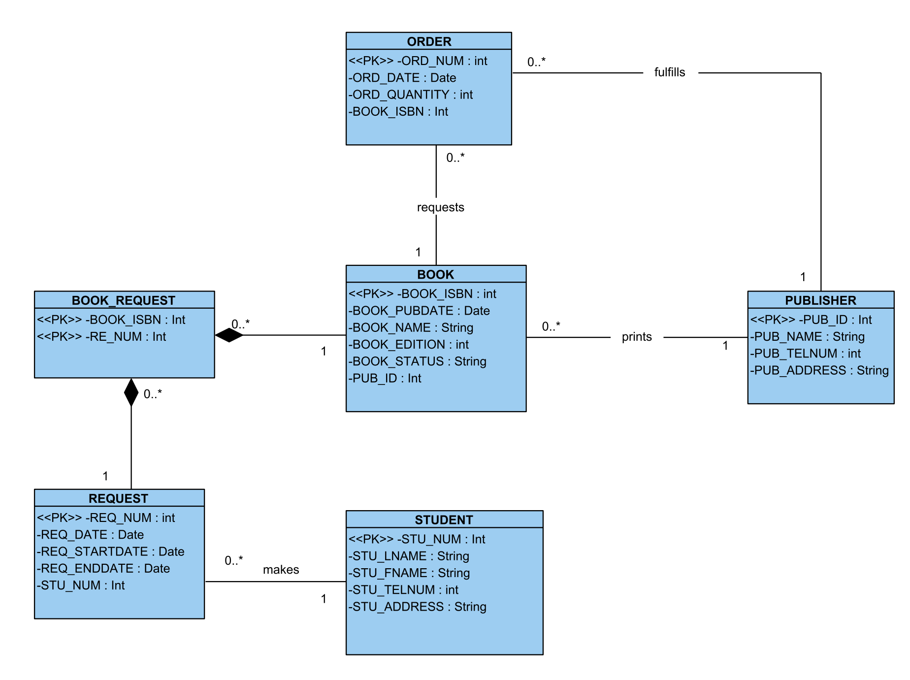
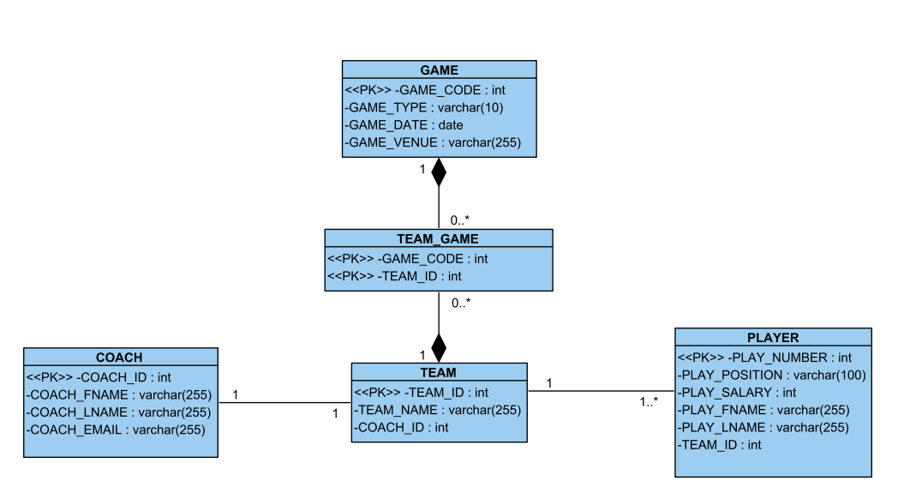

# OI 348 SQL Practical Exercises

_To make the attached class diagrams a reasonable size, you may choose to limit the width of the window to half your VS Code pane._

## Setup and Use of Trailbase

### Running Trailbase

To run the application, use the command below in the Terminal:

`./trail run`

To access it in the browser, run the application (above) and then switch to the _Ports_ tab. Here select the _Open in Browser_ button next to the forwarded address button for the port 4000. Once you do this, you **must** append `/_/admin` to the URL in the Browser for you to get the login page.

**NB:** To access the Trailbase server from multiple computers (i.e., in a group setting, or when developing from a different Codespace), you MUST change the Visibility of the port from Private to Public BEFORE opening it in the browser. To do this, you should right click on the Port 4000 row, select _Port Visibility_ and then _Public_.

If the port 4000 line item is missing in the _Ports_ tab, select _Add Port_ and type in 4000. Then follow the instructions above for public visibility and opening in the browser.

To change the default user password (substituting the provided password with the new one):

`./trail user change-password admin@localhost s3cur3P4ssw0rd`

### Using Trailbase

Once you have Trailbase at the login screen, you can log in with the below default credentials, or any changed value, per the above.

Tables can be modelled interactively in the Table & View Browser (first tab, looks like a stacked cylinder), code can be written directly in the _SQL Editor_ (pencil on paper tab), and an ERD can be seen (mini ERD graph tab).

Somewhat minimal documentation is available at https://trailbase.io/getting-started/install


### Credentials
```
Username: admin@localhost
Password: s3cur3P4ssw0rd
```

## Question Set One

For these questions, you should write SQL code against the class diagram shown below. After studying the class diagram, answer the questions (write the SQL) as per the instructions that follow.



1. Start by creating tables using SQL CREATE TABLE statements for each entity in the class diagram. Your create table statements should include a list of fields, their types, and (at least) a series of primary key, foreign key and not null constraints. You may add other constraints as you feel necessary, but they are not required by the assignment.

2. A database is useless without data. Write SQL INSERT statements for each table to add some dummy data that is relevant for each table. You should add the insert statements in a relevant order to ensure that the table constraints are honoured. Add at least three rows per table, but also ensure that each of the questions (starting at 4) can be answered when you write queries later. Feel free to add more data as you answer the later questions.

3. When you captured your data using the INSERT statements, you made a few errors. Write an UPDATE statement to adjust the order quantity to increase each order by 20%.

4. At this stage, you should have a small, but complete database. You can now move to analysing the data in your database. Start by writing a series of SQL SELECT statements that extracts all the data from each table individually.

For the remaining questions, write a suitable select statement which answers the question provided.

5. List all book titles along with the name of the book publisher.

6. List all books which have been ordered at least once.

7. List all the books along with the names of the students who have requested the book.

8. List the students who have never requested a book.


# Question Set Two

For these questions, you should write SQL code against the class diagram shown below. After studying the class diagram, answer the questions (write the SQL) as per the instructions that follow.



1. Start by creating tables using SQL CREATE TABLE statements for each entity in the class diagram. Your create table statements should include a list of fields, their types, and (at least) a series of primary key, foreign key and not null constraints. You may add other constraints as you feel necessary, but they are not required by the assignment.

2. A database is useless without data. Write SQL INSERT statements for each table to add some dummy data that is relevant for each table. You should add the insert statements in a relevant order to ensure that the table constraints are honoured. Add at least three rows per table, but also ensure that each of the questions (starting at 4) can be answered when you write queries later. Feel free to add more data as you answer the later questions.

3. When you captured your data using the INSERT statements, you made a few errors. Write an UPDATE statement to adjust players salaries to be 20% higher.

4. At this stage, you should have a small, but complete database. You can now move to analysing the data in your database. Start by writing a series of SQL SELECT statements that extracts all the data from each table individually.

For the remaining questions, write a suitable select statement which answers the question provided.

5. List all teams along with their coaches first and last names.

6. List all players whose salary is greater than 1 000 000.

7. List all the players along with their teams.

8. List the teams who have never played a game.
